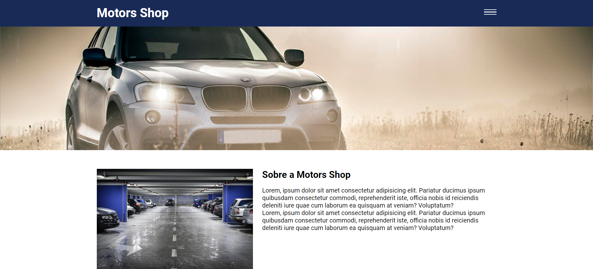

# Motors shop - jQuery plugins 


This application demonstrates the use of jQuery plugins to dynamically display information on the screen, such as an image carousel, a mask for the telephone input and for form validations. 

## Index
- <a href="#functionalities">Application functionalities</a>
- <a href="#layout">Layout</a>
- <a href="#demonstration">Demonstration</a>
- <a href="#run">How to run the application</a>
- <a href="#tecnologies-used">Tecnologies used</a>
- <a href="#developer">Developer</a>

## Application functionalities
 - [x]  Hamburguer menu
 - [x]  Image carousel 
 - [x]  Input mask
 - [x]  Form validation

## Layout


## Demonstration
[Link (deploy)](https://jquery-plugins-study.vercel.app/)

https://github.com/Julia-slvbrg/jquery-plugins-study/assets/114543081/e1afd2a6-ca50-4b39-b553-f4e1eed79f4a


## How to run the application
```bash
# Clone this repository
$ git clone repolink

# Acess the app folder on your terminal
$ cd jquery-plugins-study


# Utilize a local server launch tool to view the application in your browser

```

## Tecnologies used
1. HTML
2. CSS
3. DOM
4. Javascript
5. jQuery
6. [Slick](https://kenwheeler.github.io/slick/)
7. [jQuery Mask Plugin](https://igorescobar.github.io/jQuery-Mask-Plugin/)
8. [jQuery Validation Plugin](https://jqueryvalidation.org/)

## Developer
[LinkedIn](https://www.linkedin.com/in/julia-silva-borges/)
